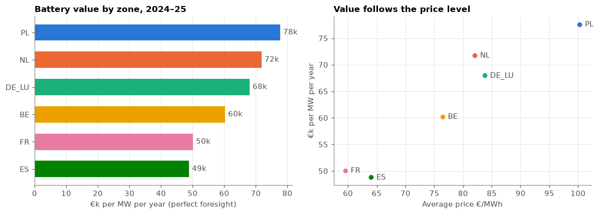
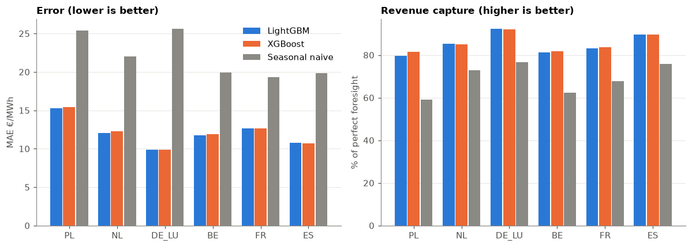
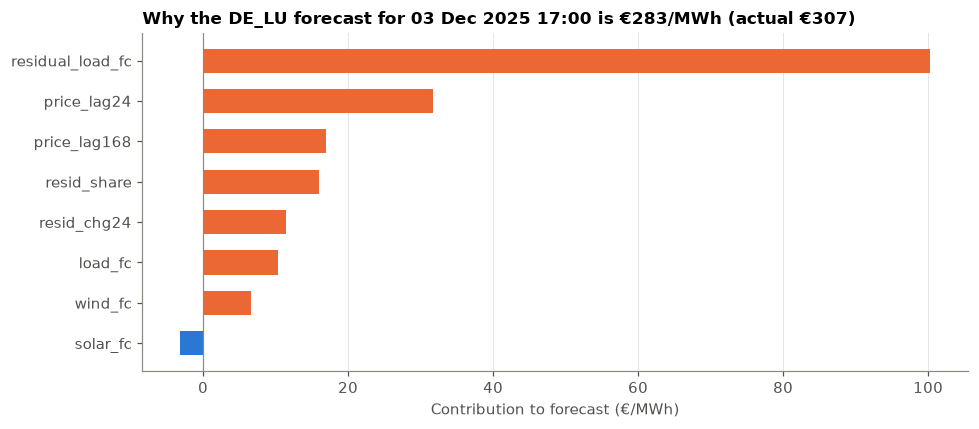

# European Power Market Data Platform

A data and analytics pipeline for **European day-ahead (SDAC) power markets**, built on the
[ENTSO-E Transparency Platform](https://transparency.entsoe.eu/). It covers:

1. **Ingestion:** day-ahead prices, load forecasts and wind/solar forecasts for 13
   bidding zones, normalised to one tidy hourly table per zone.
2. **Data quality:** coverage, gaps, duplicates and price sanity checks per zone,
   before anyone builds on the data.
3. **Battery arbitrage atlas:** which zones pay a battery most, how spreads change over
   time, and how strongly zones are coupled.
4. **Forecasting:** day-ahead price forecasts driven by fundamentals (LightGBM/XGBoost
   quantiles), scored on **battery revenue capture**, not only on error.

**Start here:** [`notebooks/01_walkthrough.ipynb`](notebooks/01_walkthrough.ipynb) walks through
the results on two years of real ENTSO-E data, with charts and explanations.



## Coverage

| Zone | EIC | | Zone | EIC |
|---|---|---|---|---|
| DE_LU | 10Y1001A1001A82H | | IT_NORD | 10Y1001A1001A73I |
| FR | 10YFR-RTE------C | | PL | 10YPL-AREA-----S |
| NL | 10YNL----------L | | DK1 | 10YDK-1--------W |
| BE | 10YBE----------2 | | NO2 | 10YNO-2--------T |
| AT | 10YAT-APG------L | | SE3 | 10Y1001A1001A46L |
| ES | 10YES-REE------0 | | FI | 10YFI-1--------U |
| PT | 10YPT-REN------W | | | |

Adding a zone means adding one line to `ZONES` in `src/eupm/data/entsoe.py`.

| ENTSO-E document | Content | Why it matters |
|---|---|---|
| A44 | Day-ahead prices | Target and lags |
| A65 / A01 | Day-ahead total load forecast | Demand driver |
| A69 / A01 | Day-ahead wind & solar forecast (B16, B18, B19) | Supply driver → residual load |

## Engineering notes

The ENTSO-E API has quirks that a market-data platform has to handle correctly:

- **Namespaces differ by document type** (publication vs. generation/load). The parser
  matches tags with a `{*}` wildcard, so one parser handles every document.
- **Mixed resolutions.** SDAC moved to a **15-minute MTU in 2025**, so PT15M, PT30M and
  PT60M series can appear in the same query. All are parsed to UTC and resampled
  explicitly.
- **Curve type A03 (compressed)** leaves out repeated points, so missing positions carry
  the last value forward. A naive parser silently loses these hours.
- **"No matching data"** comes back as an Acknowledgement document (sometimes with
  HTTP 400). It's treated as an empty result, not an error.
- **One-year request limits and rate limits**: requests are chunked, retried with
  backoff, and cached as Parquet.
- **Delivery days are market days, not UTC days.** Data is stored in UTC but grouped
  into CET/CEST delivery days, so days have 23 or 25 hours at the DST switches. On the
  25-hour day, the last hour's 24-hour lag would fall inside the same auction, so it is
  masked. Regression tests cover both.
- **No leakage.** Forecasts are issued on D-1 before 12:00 CET gate closure. Price lags
  of at least 24 hours are known by then (D-1 prices were published on D-2), and the
  day-ahead load/RES forecasts for D are already public.

## Quick start

```bash
uv sync --all-groups
export ENTSOE_API_KEY=...        # free: register on transparency.entsoe.eu, then email
                                 # transparency@entsoe.eu with subject "Restful API access"
uv run eupm zones                                    # list supported zones
uv run eupm fetch    --zones DE_LU FR NL BE ES PL    # download + data-quality report
uv run eupm atlas    --zones DE_LU FR NL BE ES PL    # + arbitrage atlas and correlation
uv run eupm backtest --zones DE_LU FR ES --test-days 90
uv run streamlit run app/dashboard.py
```

The results in `reports/` are committed, so the dashboard and notebook work without an API key.

Offline demo (synthetic data, clearly flagged in the dashboard, not for results):
`uv run eupm backtest --synthetic --zones DE_LU FR ES --test-days 14`

Quality checks (also run in GitHub Actions):
`uv run ruff check . && uv run ruff format --check . && uv run mypy src && uv run pytest`

## Results

Real ENTSO-E data, 6 zones, 1 January 2024 to 31 December 2025 (731 delivery days per zone).
Data quality: 100% price coverage, no gaps or duplicate hours in any zone.

**Arbitrage atlas** (1 MW / 2 MWh, 88% RTE, 1.5 cycles/day, perfect foresight, hourly prices)

| Zone | Avg price €/MWh | Avg daily spread €/MWh | €/MW/year | Negative-price hours |
|---|---|---|---|---|
| PL | 100.3 | 132.0 | 77,600 | 2.9% |
| NL | 82.0 | 118.1 | 71,800 | 5.9% |
| DE_LU | 83.8 | 113.0 | 68,000 | 4.7% |
| BE | 76.4 | 101.3 | 60,200 | 5.3% |
| FR | 59.5 | 83.0 | 50,100 | 4.9% |
| ES | 64.0 | 84.2 | 48,800 | 4.8% |

**Day-ahead forecast back-test** (walk-forward, last 90 days of 2025, 180-day training window)

| Zone | LightGBM MAE €/MWh | Naive MAE €/MWh | LightGBM revenue capture | Naive revenue capture |
|---|---|---|---|---|
| DE_LU | 9.9 | 25.6 | 92% | 77% |
| ES | 10.7 | 19.9 | 90% | 76% |
| NL | 12.0 | 22.1 | 85% | 73% |
| FR | 12.6 | 19.3 | 83% | 68% |
| BE | 11.8 | 19.9 | 81% | 62% |
| PL | 15.3 | 25.4 | 80% | 59% |

XGBoost results are within one percentage point of LightGBM in every zone (see the notebook).



**Findings**

- **Battery value follows the price level.** Daily battery value tracks the daily spread
  (correlation 0.90–0.98), and the spread is about 1.3–1.4× the average price in every zone.
  So the ranking is mostly a ranking of price level. Poland is first because coal, lignite and
  carbon costs make its evening peak expensive. It has the *fewest* negative-price hours of the
  six: the evening peak pays a battery, not negative prices.
- **Same daily shape everywhere.** Prices are lowest at 12:00–14:00 and highest at 19:00
  (21:00 in Spain). This is the solar-shift cycle a 2-hour battery is sized for.
- **2025 paid more than 2024 in every zone** (+11% to +25%), with wider spreads and more
  negative-price hours.
- **Fundamentals beat price history.** Using day-ahead load, wind and solar forecasts, the
  models roughly halve the error of the seasonal naive baseline and capture 80–92% of
  perfect-foresight revenue, against 59–77% for the baseline.
- **Revenue capture tells you more than MAE.** Zones with similar MAE differ by more than 10
  points in capture, because capture depends on getting the timing of cheap and expensive hours right.
- **Residual load drives the forecasts.** SHAP values show it as the largest driver, about five
  times yesterday's price. In the most extreme December hour (a *Dunkelflaute* evening: 70 GW
  load, 4 GW wind, no solar), it alone added about €100/MWh to the forecast.



**Known weakness:** the P10–P90 bands contain only 40–60% of actual prices instead of 80%,
so the quantile models are overconfident. Conformal calibration is the planned fix.

## Project layout

```
src/eupm/
  data/entsoe.py     ENTSO-E client, XML parser, zone registry, Parquet cache
  data/synthetic.py  offline test data (not real)
  analytics.py       quality report, arbitrage atlas, correlation, forecasting back-test
  models.py          LightGBM / XGBoost quantile models
  battery.py         LP dispatch (HiGHS via SciPy) + settlement
  config.py          pydantic settings
  cli.py             `eupm zones|fetch|atlas|backtest`
app/dashboard.py     Streamlit dashboard
notebooks/           walkthrough of the results (imports from src/, no logic of its own)
tests/               parser fixtures in the real API's XML format, analytics and LP tests
```

## Design choices

- **Revenue capture over MAE.** Battery value depends on the *shape* of the day. A flat
  P50 that understates the spread leads the LP (with degradation cost and efficiency
  losses) to decide not to trade, so capture falls to zero even when MAE looks fine.
- **Perfect foresight as the benchmark.** The atlas gives the upper bound per zone, and
  forecast capture % shows how much of it a model actually earns.
- **Quality report first.** Coverage and gap statistics are produced before any analysis,
  so issues in the data aren't mistaken for findings.

## Next steps

- **Calibrate the uncertainty bands** with conformal prediction, so the P10–P90 band actually
  covers 80% of outcomes.
- **Benchmark against LEAR** (Lago et al., 2021), the standard reference model for day-ahead
  price forecasting, with a Diebold–Mariano test to show whether differences are significant.
- **Add TTF gas and EUA carbon prices** as fundamentals.
- **Run the LP on native 15-minute prices** (SDAC since October 2025). Hourly means understate
  the spread.
- **Measure coupling as price convergence** (share of hours with equal prices) rather than
  correlation, which partly reflects shared fuel prices.
- Add intraday and balancing/aFRR data for revenue stacking.

## Author

Kirankumar Ashok Patil: [LinkedIn](https://linkedin.com/in/kirankumarashokpatil)
